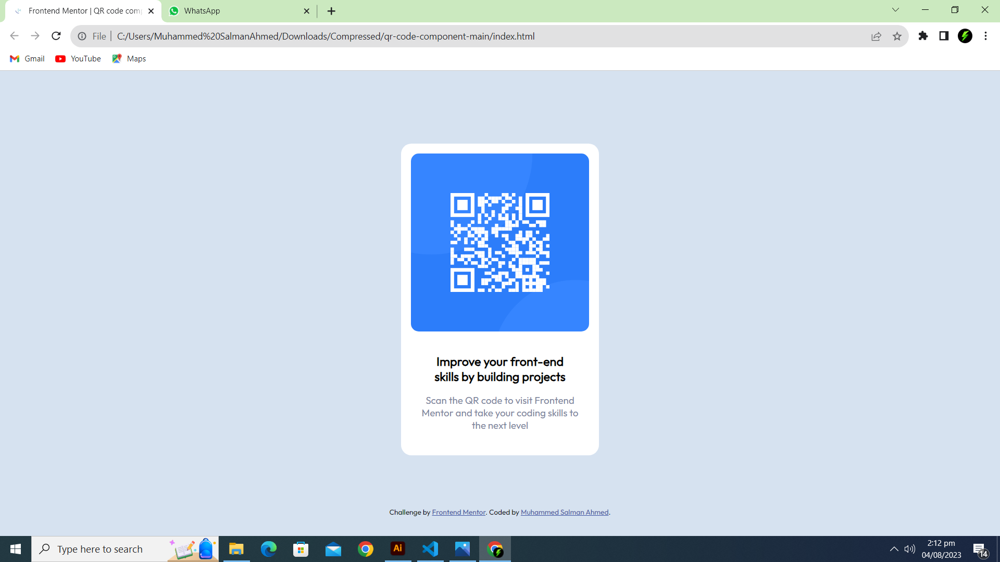

# Frontend Mentor - QR code component solution

This is a solution to the [QR code component challenge on Frontend Mentor](https://www.frontendmentor.io/challenges/qr-code-component-iux_sIO_H). Frontend Mentor challenges help you improve your coding skills by building realistic projects. 

## Table of contents

- [Overview](#overview)
  - [Screenshot](#screenshot)
  - [Links](#links)
- [My process](#my-process)
  - [Built with](#built-with)
  - [What I learned](#what-i-learned)
  - [Continued development](#continued-development)
- [Author](#author)

## Overview
I built this QR code website using HTML and CSS on VS Code.
### Screenshot




### Links

- Solution URL: (https://github.com/MuhammedSalmanAhmed/QR-Code-Challenge-Frontend-Mentor)
- Live Site URL: [Add live site URL here](https://your-live-site-url.com)

## My process

Based on given design picture and style-guide. I applied CSS rules to index.html file to make it look as close as possible to result.

### Built with

- Semantic HTML5 markup
- CSS custom properties

### What I learned

Use this section to recap over some of your major learnings while working through this project. Writing these out and providing code samples of areas you want to highlight is a great way to reinforce your own knowledge.

To see how you can add code snippets, see below:

```html
<h1>Building new classes as well as div elements.</h1>
```
```css
.QR-desc {
  padding-bottom: 12%;
}
.QR-image {
  border-radius:12rem
}
```

### Continued development

I would like to improve my concept of margins, padding and positioning more.

## Author

- Website - [Muhammed Salman Ahmed](https://muhammedsalmanahmed.github.io/CV-CSS/)
- Frontend Mentor - [@MuhammedSalmanAhmed](https://www.frontendmentor.io/profile/MuhammedSalmanAhmed)
- Facebook - [Muhammed Salman Ahmed](https://www.facebook.com/profile.php?id=100075963945987)